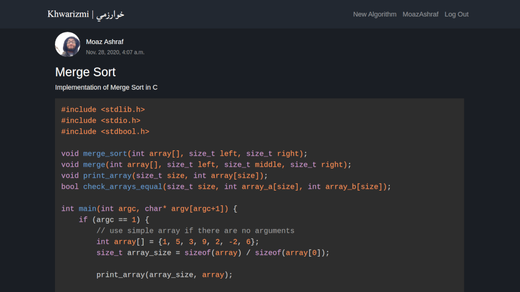

# Khwarizmi
An algorithm sharing and discussion platform. The app is deployed using Heroku at [khwarizmiapp.herokuapp.com](khwarizmiapp.herokuapp.com).

## Current Features:
- Standard user authentication and authorization system (signup, login, logout, password reset, etc.)
- Create, update and delete algorithms (posts).
- Code highlighting in algorithms.
- Write comments to algorithms.
- Edit profile bio, profile pic and display name.

## Technologies Used:
- **Python** and **Django** for the backend.
- **Heroku** for deployment (and **PostgreSQL** for the database).
- User file uploads (currently only profile pics) are handled by **AWS S3**.
- **Bootstrap 4** for the frontend.
- Code highlighting is handled by **highlight.js**.